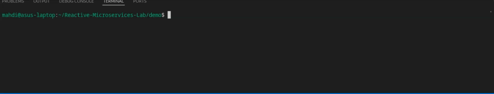

# Reactive-Microservices-Lab

Project Demo
============

This project demonstrates how to run and interact with a Kafka-based messaging system using Docker Compose and Make.

Prerequisites
-------------

Before running the demo, ensure you have the following installed on your system:

*   Docker
    
*   Docker Compose
    
*   Make
    

Getting Started
---------------

To set up and run the demo, follow these steps:

1.  shCopier le codedocker-compose up
    
2.  shCopier le codemake start
    
3.  shCopier le codemake watch-kafka
    
4.  shCopier le codemake trigger
    

Makefile Targets
----------------
*   **make init** : to start infra and install dependencies

*   **make start-app-1** : to start the risk-management-service

*   **make start-app-2** : to start the ocr service
    
*   **make trigger**: Triggers a new Kafka message and watch the demo
    

Additional Information
----------------------

For more details on how the system works or to customize the demo, refer to the source files and configurations provided in this repository.